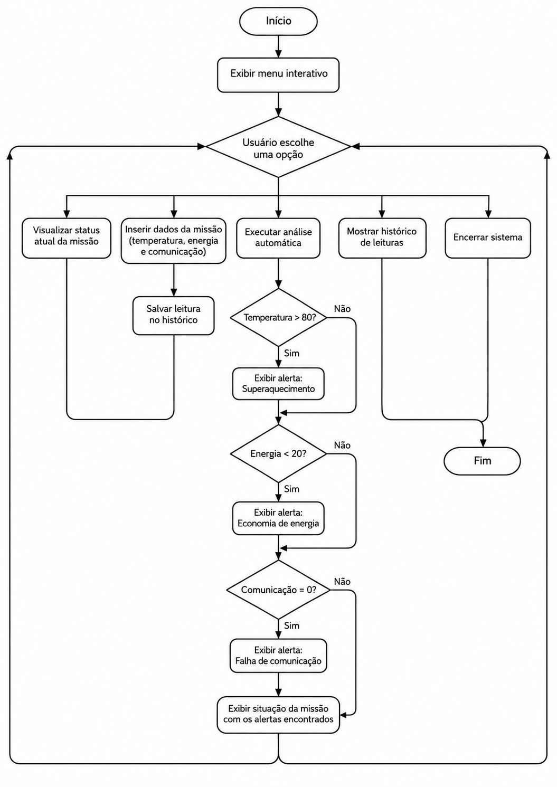
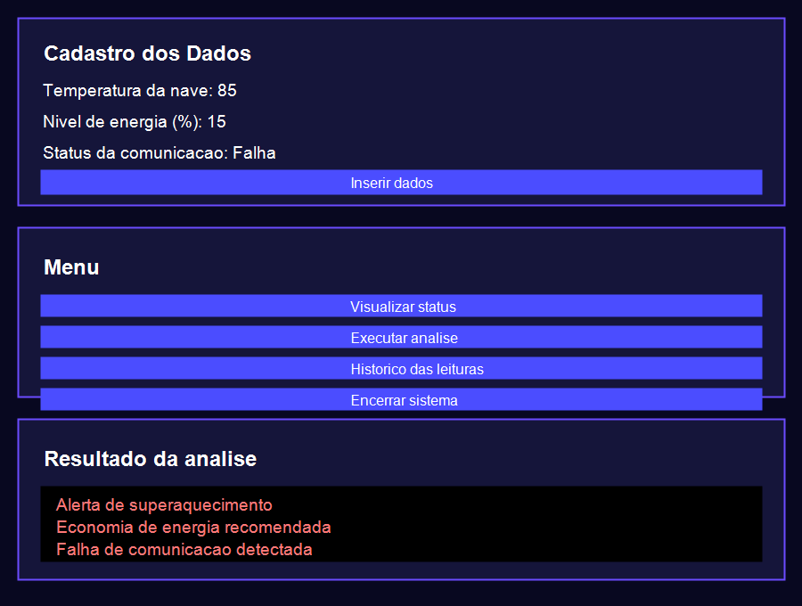

# Monitoramento de Missão Espacial

## Descrição

Projeto desenvolvido para a atividade GS2026.1 - Data Structure and Algorithms.

O sistema simula o monitoramento básico de uma missão espacial experimental. Ele permite cadastrar dados da nave, visualizar o status atual, executar análise automática, consultar histórico de leituras e encerrar o sistema.

## Funcionalidades

- Inserir dados da missão;
- Visualizar o status atual;
- Executar análise automática;
- Consultar histórico de leituras;
- Encerrar o sistema.

## Dados monitorados

- Temperatura da nave;
- Nível de energia;
- Status da comunicação.

## Regras de análise

| Condição | Resultado |
|---|---|
| Temperatura maior que 80 | Alerta de superaquecimento |
| Energia menor que 20% | Economia de energia |
| Comunicação igual a 0 | Falha de comunicação |

## Estruturas utilizadas

Foram utilizadas estruturas básicas de programação, como:

- Condicionais;
- Laços de repetição;
- Listas/vetores;
- Funções;
- Entrada e saída de dados pela interface do sistema.

## Como executar

1. Baixe ou clone este repositório.
2. Abra a pasta do projeto no VS Code ou em outro editor.
3. Abra o arquivo `Gs_DSA.html` no navegador.
4. Insira os dados da missão e use o menu para visualizar status, executar análise, consultar histórico ou encerrar o sistema.

## Fluxograma



## Demonstração prática

Exemplo de funcionamento do sistema:

```text
===== MENU =====
1 - Inserir dados
2 - Visualizar status
3 - Executar análise
4 - Histórico
5 - Encerrar

Temperatura: 85
Energia: 15
Comunicação: 0

Resultado da análise:
Alerta de superaquecimento
Economia de energia recomendada
Falha de comunicação detectada
```




